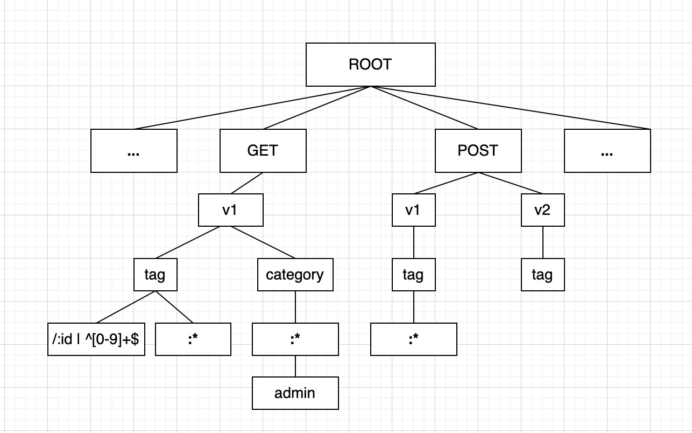

# gotk (go toolkit)

这是一个 Go 工具包，其中包括 HTTP 多路复用器 mux；errs 基于 REST API 开发公共错误码处理；form 是一套 Form 表单验证器。 

mux | [errs](./errs.md) 

mux 是一个基于 Trie (前缀树) 数据结构的 HTTP 多路复用路由器，支持动态路由和正则表路由，
支持路由分组、中间件、NotFound 404 处理， MethodNotAllowed 请求方法不允许处理（需要手动开启）。
同时还支持一些不太合理的路由。

API路由和数据存储对应关系是这样的：

``` txt
GET /v1/tag/:id|^[0-9]+$ 
GET /v1/tag/:name
GET /v1/category/:name/admin

POST /v1/tag
POST /v1/tag/:id|^[0-9]+$
POST /v2/tag
```


## 快速尝试
```
    "github.com/lightsaid/gotk/mux"
```

``` go
func main() {
	router := mux.NewServeMux()
    // 对单独路由使用中间件
	router.GET("/", handlerEcho).Use(helloMiddleware)
	router.GET("/api/", handlerEcho)
	router.GET("/api/:name", handlerEcho)
	router.GET("/api/:name/:id|^[0-9]+", handlerEcho)
	router.GET("/api/:cat/cat", handlerEcho)
	router.GET("/api/:dog/dog", handlerEcho)
	router.GET("/api/:fish/fish", handlerEcho)
	router.GET("/api/:fish/fish/:id|^[a-zA-Z]+$", handlerEcho)
	router.GET("/api/:fish/fish/:id|^[a-zA-Z]+$/:age|^[0-9]+$", handlerEcho)

    // 全局路由中间件
	router.Use(sinceMiddleware, helloMiddleware)

    // 开启 Method Not Allowed handler， 默认不处理，返回 404
	router.OpenAllowed()

    // 路由分组
	group := router.RouteGroup("/v1/auth")

	// 局部中间件，仅对这一组路由起效
	group.Use(sinceMiddleware)

	group.POST("/login", handlerEcho).Use(helloMiddleware)

	// 支持多 method, 如果不指定 Method, 默认支持所有
	group.HandleFunc("/profile", handlerEcho, http.MethodGet, http.MethodPost)

	http.ListenAndServe(":8888", router)
}

func handlerEcho(w http.ResponseWriter, r *http.Request) {
	params := map[string]string{}

    // 获取路由动态参数
	params["name"] = mux.Param(r, "name")
	params["id"] = mux.Param(r, "id")
	params["cat"] = mux.Param(r, "cat")
	params["dog"] = mux.Param(r, "dog")
	params["fish"] = mux.Param(r, "fish")
	params["age"] = mux.Param(r, "age")

	json.NewEncoder(w).Encode(params)
}

func helloMiddleware(handler http.Handler) http.Handler {
	return http.HandlerFunc(func(w http.ResponseWriter, r *http.Request) {
		log.Println("Hello World")
		handler.ServeHTTP(w, r)
	})
}

func sinceMiddleware(handler http.Handler) http.Handler {
	return http.HandlerFunc(func(w http.ResponseWriter, r *http.Request) {
		t := time.Now()
		handler.ServeHTTP(w, r)
		log.Printf("%s %s %s \n", r.Method, r.URL.Path, time.Since(t))
	})
}

```

